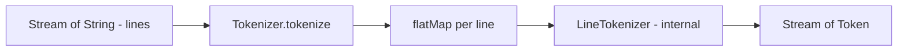

# Stream-Based Tokenizer Design

## Overview

This document outlines the design for replacing the existing `Tokenizer` with a stream-based implementation that transforms `Stream<String>` (lines of source code) into `Stream<Token>`.

## Design Decisions

| Decision | Choice | Rationale |
|----------|--------|-----------|
| Exception handling | Unchecked exceptions | Java Streams don't support checked exceptions; cleaner API |
| Laziness | Fully lazy | Memory efficient, supports infinite/large inputs |
| EOF token | **Kept** | Simplifies parser implementation; explicit end-of-input marker |
| Position tracking | Global line numbers | Each String represents a line; maintain accurate positions |

---

## Architecture



### Key Components

1. **Tokenizer** - Public API, transforms `Stream<String>` → `Stream<Token>`
2. **LineTokenizer** - Internal helper, tokenizes a single line with position context
3. **Token** - Record with `STRING` type added, `EOF` kept for parser convenience
4. **TokenizerException** - Changed to extend `RuntimeException`

---

## API Design

### Tokenizer Class

```java
public final class Tokenizer {
    
    private Tokenizer() {} // Utility class, no instantiation
    
    /**
     * Tokenizes a stream of source lines into a stream of tokens.
     * Each string in the input stream represents one line of source code.
     * 
     * @param lines stream of source code lines
     * @return lazy stream of tokens
     * @throws TokenizerException if invalid input is encountered
     */
    public static Stream<Token> tokenize(Stream<String> lines) {
        var lineCounter = new AtomicInteger(0);
        return lines.flatMap(line -> tokenizeLine(line, lineCounter.incrementAndGet()));
    }
    
    /**
     * Convenience method for tokenizing a single string.
     * Splits by newlines and tokenizes.
     */
    public static Stream<Token> tokenize(String source) {
        return tokenize(source.lines());
    }
    
    /**
     * Convenience method for tokenizing from a Reader.
     * Reads lines lazily.
     */
    public static Stream<Token> tokenize(BufferedReader reader) {
        return tokenize(reader.lines());
    }
    
    private static Stream<Token> tokenizeLine(String line, int lineNumber) {
        // Returns stream of tokens from this line
    }
}
```

### Token Changes

Add `STRING` type, keep `EOF` for parser convenience:

```java
public record Token(TokenType type, String value, Position position) {

    public enum TokenType {
        LEFT_PAREN,
        RIGHT_PAREN,
        DOT,
        QUOTE,
        ATOM,
        STRING,  // NEW: string literals
        EOF      // KEPT: simplifies parser implementation
    }

    // Factory methods - all existing ones kept, string() added
    public static Token leftParen(Position position) { ... }
    public static Token rightParen(Position position) { ... }
    public static Token dot(Position position) { ... }
    public static Token quote(Position position) { ... }
    public static Token atom(String value, Position position) { ... }
    public static Token string(String value, Position position) { ... }  // NEW
    public static Token eof(Position position) { ... }  // KEPT
}
```

**Note**: The stream will emit an `EOF` token as its final element. This allows the parser to check for end-of-input without needing to handle stream exhaustion separately.

### TokenizerException Changes

Convert to unchecked exception:

```java
public class TokenizerException extends RuntimeException {
    
    private final Position position;
    
    public TokenizerException(String message) {
        super(message);
        this.position = null;
    }
    
    public TokenizerException(String message, Position position) {
        super(message + " at " + position);
        this.position = position;
    }
    
    public Position getPosition() {
        return position;
    }
}
```

---

## Implementation Strategy

### Line Tokenization

Each line is tokenized independently, producing a stream of tokens. The line number is passed in for position tracking.

```java
private static Stream<Token> tokenizeLine(String line, int lineNumber) {
    return StreamSupport.stream(
        new LineTokenizerSpliterator(line, lineNumber),
        false // not parallel
    );
}
```

### LineTokenizerSpliterator

A custom `Spliterator<Token>` that lazily produces tokens from a single line:

```java
private static class LineTokenizerSpliterator implements Spliterator<Token> {
    private final String line;
    private final int lineNumber;
    private int column;
    private int offset; // offset within line
    
    LineTokenizerSpliterator(String line, int lineNumber) {
        this.line = line;
        this.lineNumber = lineNumber;
        this.column = 1;
        this.offset = 0;
    }
    
    @Override
    public boolean tryAdvance(Consumer<? super Token> action) {
        skipWhitespace();
        if (offset >= line.length()) {
            return false; // no more tokens on this line
        }
        
        Token token = readNextToken();
        action.accept(token);
        return true;
    }
    
    @Override
    public Spliterator<Token> trySplit() {
        return null; // no splitting support
    }
    
    @Override
    public long estimateSize() {
        return Long.MAX_VALUE; // unknown
    }
    
    @Override
    public int characteristics() {
        return ORDERED | NONNULL;
    }
    
    private Token readNextToken() {
        char c = line.charAt(offset);
        Position pos = new Position(lineNumber, column, offset);
        
        return switch (c) {
            case '(' -> { advance(); yield Token.leftParen(pos); }
            case ')' -> { advance(); yield Token.rightParen(pos); }
            case '\'' -> { advance(); yield Token.quote(pos); }
            case '.' -> {
                advance();
                if (offset >= line.length() || isDelimiter(line.charAt(offset))) {
                    yield Token.dot(pos);
                }
                yield readAtom(pos, ".");
            }
            default -> readAtom(pos, "");
        };
    }
    
    // ... helper methods
}
```

---

## Position Tracking

### Current Approach
The existing tokenizer tracks:
- `line` - 1-based line number
- `column` - 1-based column within line  
- `offset` - 0-based character offset from start of input

### Stream Approach
With line-based input:
- `line` - Derived from stream element index (1-based)
- `column` - 1-based column within the current line
- `offset` - 0-based offset within the current line (NOT global)

**Important change**: The `offset` field semantics change from global to per-line. This simplifies implementation but changes the meaning.

### Alternative: Global Offset Tracking

If global offset is required, we need to track cumulative line lengths:

```java
public static Stream<Token> tokenize(Stream<String> lines) {
    var state = new Object() {
        int lineNumber = 0;
        int globalOffset = 0;
    };
    
    return lines.flatMap(line -> {
        state.lineNumber++;
        int lineStart = state.globalOffset;
        state.globalOffset += line.length() + 1; // +1 for newline
        return tokenizeLine(line, state.lineNumber, lineStart);
    });
}
```

---

## Parser Integration

The [`Parser`](src/main/java/lti/scheme/parser/Parser.java:7) currently expects a `Tokenizer` instance and calls `nextToken()`. It needs to be updated to work with `Stream<Token>` or `Iterator<Token>`.

### Option 1: Iterator-based Parser

```java
public final class Parser {
    private final Iterator<Token> tokens;
    private Token current;
    private boolean hasMore;
    
    public Parser(Stream<Token> tokenStream) {
        this.tokens = tokenStream.iterator();
        advance();
    }
    
    private void advance() {
        if (tokens.hasNext()) {
            current = tokens.next();
            hasMore = true;
        } else {
            hasMore = false;
            current = null;
        }
    }
    
    public Value parseValue() {
        if (!hasMore) {
            throw new ParserException("Unexpected end of input");
        }
        // ... rest of parsing logic
    }
}
```

### Option 2: PeekableIterator Wrapper

```java
public final class Parser {
    private final PeekableIterator<Token> tokens;
    
    public Parser(Stream<Token> tokenStream) {
        this.tokens = new PeekableIterator<>(tokenStream.iterator());
    }
    
    // peek() and next() available
}
```

---

## Test Updates

### TokenizerTest Changes

Current tests use:
```java
var tokenizer = new Tokenizer("hello");
var token = tokenizer.nextToken();
```

New tests will use:
```java
var tokens = Tokenizer.tokenize("hello").toList();
assertEquals(1, tokens.size());
assertEquals(TokenType.ATOM, tokens.get(0).type());
```

### EOF Token Tests

Tests checking for `EOF` tokens need to be updated to check for stream termination:

```java
// Before
var eof = tokenizer.nextToken();
assertEquals(TokenType.EOF, eof.type());

// After
var tokens = Tokenizer.tokenize("hello").toList();
assertEquals(1, tokens.size()); // no EOF token
```

---

## Migration Checklist

### Files to Modify

| File | Changes |
|------|---------|
| [`Token.java`](src/main/java/lti/scheme/parser/Token.java) | Remove `EOF` from `TokenType`, remove `eof()` factory |
| [`TokenizerException.java`](src/main/java/lti/scheme/parser/TokenizerException.java) | Extend `RuntimeException` instead of `Exception` |
| [`Tokenizer.java`](src/main/java/lti/scheme/parser/Tokenizer.java) | Complete rewrite to stream-based API |
| [`Parser.java`](src/main/java/lti/scheme/parser/Parser.java) | Update to consume `Stream<Token>` or `Iterator<Token>` |
| [`TokenizerTest.java`](src/test/java/lti/scheme/TokenizerTest.java) | Update all tests for new API |
| [`ParserTest.java`](src/test/java/lti/scheme/ParserTest.java) | Update if needed for new Tokenizer integration |

### Backward Compatibility

This is a **breaking change**. The API changes from:
- Instance-based `new Tokenizer(input)` → Static `Tokenizer.tokenize(input)`
- Pull-based `nextToken()` → Push-based `Stream<Token>`
- Checked exceptions → Unchecked exceptions
- Explicit `EOF` token → Implicit stream end

---

## Example Usage

### Basic Tokenization

```java
// From string
Stream<Token> tokens = Tokenizer.tokenize("(define x 42)");
tokens.forEach(System.out::println);

// From lines
Stream<String> lines = Stream.of("(define x", "  42)");
Stream<Token> tokens = Tokenizer.tokenize(lines);

// From file
try (var reader = Files.newBufferedReader(path)) {
    Tokenizer.tokenize(reader)
        .forEach(System.out::println);
}
```

### With Parser

```java
// Parse single expression
Value value = new Parser(Tokenizer.tokenize("(+ 1 2)")).parseValue();

// Convenience method
Value value = Parser.parse("(+ 1 2)");
```

---

## Resolved Design Decisions

1. **Position.offset**: **Global offset** - maintains cumulative offset across all lines for accurate error reporting and source mapping.

2. **Comments**: **Yes** - `;` starts a comment that extends to end of line. Comments are skipped during tokenization (not emitted as tokens).

3. **String literals**: **Yes** - `"hello"` is tokenized as a `STRING` token. Supports escape sequences.

---

## Extended Token Types

With string literal support, the `TokenType` enum becomes:

```java
public enum TokenType {
    LEFT_PAREN,
    RIGHT_PAREN,
    DOT,
    QUOTE,
    ATOM,
    STRING,  // NEW: string literals
    EOF      // KEPT: simplifies parser implementation
}
```

### String Token Factory

```java
public static Token string(String value, Position position) {
    return new Token(TokenType.STRING, value, position);
}
```

---

## Comment Handling

Comments start with `;` and extend to end of line:

```scheme
(define x 42) ; this is a comment
; entire line comment
(+ x 1)
```

Comments are **skipped** during tokenization - they do not produce tokens. This is handled in the whitespace-skipping phase:

```java
private void skipWhitespaceAndComments() {
    while (offset < line.length()) {
        char c = line.charAt(offset);
        if (Character.isWhitespace(c)) {
            advance();
        } else if (c == ';') {
            // Skip rest of line
            offset = line.length();
            column = line.length() + 1;
            break;
        } else {
            break;
        }
    }
}
```

---

## String Literal Parsing

String literals are enclosed in double quotes and support escape sequences:

| Escape | Meaning |
|--------|---------|
| `\\` | Backslash |
| `\"` | Double quote |
| `\n` | Newline |
| `\t` | Tab |
| `\r` | Carriage return |

### Implementation

```java
private Token readString(Position start) {
    advance(); // consume opening quote
    var sb = new StringBuilder();
    
    while (offset < line.length()) {
        char c = line.charAt(offset);
        
        if (c == '"') {
            advance(); // consume closing quote
            return Token.string(sb.toString(), start);
        }
        
        if (c == '\\') {
            advance();
            if (offset >= line.length()) {
                throw new TokenizerException("Unterminated escape sequence", currentPosition());
            }
            char escaped = line.charAt(offset);
            sb.append(switch (escaped) {
                case 'n' -> '\n';
                case 't' -> '\t';
                case 'r' -> '\r';
                case '\\' -> '\\';
                case '"' -> '"';
                default -> throw new TokenizerException(
                    "Unknown escape sequence: \\" + escaped, currentPosition());
            });
            advance();
        } else {
            sb.append(c);
            advance();
        }
    }
    
    throw new TokenizerException("Unterminated string literal", start);
}
```

### Multi-line Strings

Strings are **single-line only**. A string that reaches end of line without closing quote throws `TokenizerException`.

---

## Updated Token Switch

The main tokenization switch now includes string handling:

```java
private Token readNextToken() {
    char c = line.charAt(offset);
    Position pos = currentPosition();
    
    return switch (c) {
        case '(' -> { advance(); yield Token.leftParen(pos); }
        case ')' -> { advance(); yield Token.rightParen(pos); }
        case '\'' -> { advance(); yield Token.quote(pos); }
        case '"' -> readString(pos);
        case '.' -> {
            advance();
            if (offset >= line.length() || isDelimiter(line.charAt(offset))) {
                yield Token.dot(pos);
            }
            yield readAtom(pos, ".");
        }
        default -> readAtom(pos, "");
    };
}
```

---

## Global Offset Tracking Implementation

To maintain global offsets across lines:

```java
public static Stream<Token> tokenize(Stream<String> lines) {
    var state = new Object() {
        int lineNumber = 0;
        int globalOffset = 0;
    };
    
    return lines.flatMap(line -> {
        state.lineNumber++;
        int lineStartOffset = state.globalOffset;
        state.globalOffset += line.length() + 1; // +1 for newline character
        return tokenizeLine(line, state.lineNumber, lineStartOffset);
    });
}
```

The `Position` for each token uses:
- `line` = current line number (1-based)
- `column` = position within line (1-based)
- `offset` = `lineStartOffset + columnWithinLine - 1` (0-based global)

---

## Updated Migration Checklist

### Files to Modify

| File | Changes |
|------|---------|
| [`Token.java`](src/main/java/lti/scheme/parser/Token.java) | Add `STRING` type and factory (keep `EOF`) |
| [`TokenizerException.java`](src/main/java/lti/scheme/parser/TokenizerException.java) | Extend `RuntimeException`, add position field |
| [`Tokenizer.java`](src/main/java/lti/scheme/parser/Tokenizer.java) | Complete rewrite: stream-based, comments, strings, EOF at end |
| [`Parser.java`](src/main/java/lti/scheme/parser/Parser.java) | Update to consume `Iterator<Token>`, handle STRING tokens |
| [`Value.java`](src/main/java/lti/scheme/Value.java) | Add `Str(String value)` record for string values |
| [`TokenizerTest.java`](src/test/java/lti/scheme/TokenizerTest.java) | Update all tests, add comment and string tests |
| [`ParserTest.java`](src/test/java/lti/scheme/ParserTest.java) | Add string literal parsing tests |

---

## Test Cases for New Features

### Comment Tests

```java
@Test
void skipLineComment() {
    var tokens = Tokenizer.tokenize("a ; comment\nb").toList();
    assertEquals(2, tokens.size());
    assertEquals("a", tokens.get(0).value());
    assertEquals("b", tokens.get(1).value());
}

@Test
void skipFullLineComment() {
    var tokens = Tokenizer.tokenize("; comment\na").toList();
    assertEquals(1, tokens.size());
    assertEquals("a", tokens.get(0).value());
}
```

### String Literal Tests

```java
@Test
void tokenizeString() {
    var tokens = Tokenizer.tokenize("\"hello\"").toList();
    assertEquals(1, tokens.size());
    assertEquals(TokenType.STRING, tokens.get(0).type());
    assertEquals("hello", tokens.get(0).value());
}

@Test
void tokenizeStringWithEscapes() {
    var tokens = Tokenizer.tokenize("\"hello\\nworld\"").toList();
    assertEquals(1, tokens.size());
    assertEquals("hello\nworld", tokens.get(0).value());
}

@Test
void unterminatedStringThrows() {
    assertThrows(TokenizerException.class, () ->
        Tokenizer.tokenize("\"hello").toList());
}
```

### Global Offset Tests

```java
@Test
void globalOffsetAcrossLines() {
    var tokens = Tokenizer.tokenize("a\nb").toList();
    assertEquals(0, tokens.get(0).position().offset()); // 'a' at offset 0
    assertEquals(2, tokens.get(1).position().offset()); // 'b' at offset 2 (after 'a' and '\n')
}
```
