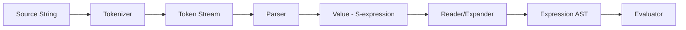
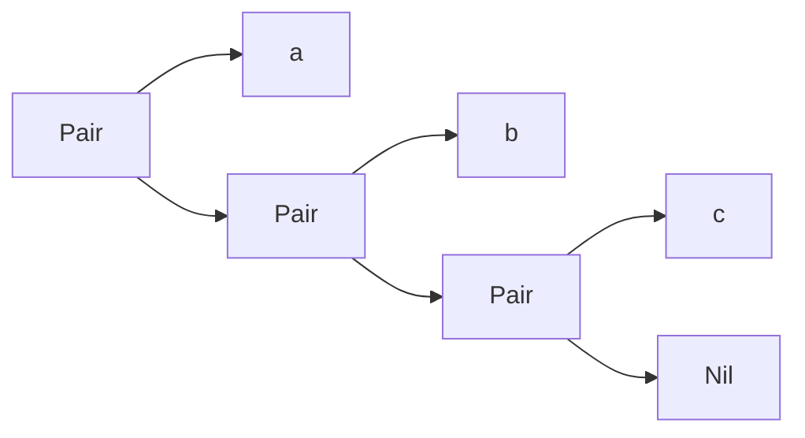
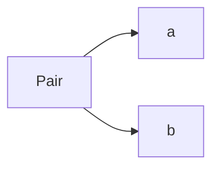

# S-Expression Tokenizer and Parser Design

## Overview

This document outlines a **minimal** tokenizer and parser for S-expressions. The parser produces `Value` objects directly (not `Expression` AST nodes). The conversion from S-expressions to `Expression` types would be a separate "reader" or "expander" phase.

## Architecture



The tokenizer and parser handle **only** the syntactic structure:
- Atoms: symbols, booleans
- Lists: built from cons cells (Pair)
- Dotted pairs: improper lists like `(a . b)`
- Quote syntax: `'expr` expands to `(quote expr)`

---

## Value Type Extension

Add `Pair` and `Nil` to the existing [`Value.java`](src/main/java/lti/scheme/Value.java):

```java
sealed interface Value {
    record Symbol(String name) implements Value {}
    record Bool(boolean bool) implements Value {}
    record Closure(Symbol formal, Expression body, Environment env) implements Value {}
    
    // NEW: Cons cells for building lists
    record Pair(Value car, Value cdr) implements Value {}
    
    // NEW: Empty list
    record Nil() implements Value {}
}
```

### List Representation

Lists are built from nested `Pair` values terminated by `Nil`:

```
(a b c)  →  Pair(Symbol("a"), Pair(Symbol("b"), Pair(Symbol("c"), Nil())))
```



### Dotted Pair Representation

Dotted pairs allow improper lists where the cdr is not `Nil`:

```
(a . b)    →  Pair(Symbol("a"), Symbol("b"))
(a b . c)  →  Pair(Symbol("a"), Pair(Symbol("b"), Symbol("c")))
```



### Quote Representation

The quote syntax `'expr` is syntactic sugar that expands to `(quote expr)`:

```
'x        →  Pair(Symbol("quote"), Pair(Symbol("x"), Nil()))
'(a b)    →  Pair(Symbol("quote"), Pair(Pair(Symbol("a"), Pair(Symbol("b"), Nil())), Nil()))
```

---

## Token Types

Minimal token set - 6 types:

```java
sealed interface Token {
    record LeftParen() implements Token {}
    record RightParen() implements Token {}
    record Dot() implements Token {}
    record Quote() implements Token {}
    record Atom(String text) implements Token {}
    record Eof() implements Token {}
}
```

| Token | Character | Purpose |
|-------|-----------|---------|
| `LeftParen` | `(` | Start of list |
| `RightParen` | `)` | End of list |
| `Dot` | `.` | Dotted pair separator |
| `Quote` | `'` | Quote prefix |
| `Atom` | any | Symbols, booleans, etc. |
| `Eof` | - | End of input |

---

## Tokenizer

### Class Design

```java
public final class Tokenizer {
    private final String input;
    private int position;
    
    public Tokenizer(String input) {
        this.input = input;
        this.position = 0;
    }
    
    public Token nextToken() throws TokenizerException {
        skipWhitespace();
        
        if (position >= input.length()) {
            return new Eof();
        }
        
        char c = input.charAt(position);
        
        return switch (c) {
            case '(' -> { position++; yield new LeftParen(); }
            case ')' -> { position++; yield new RightParen(); }
            case '\'' -> { position++; yield new Quote(); }
            case '.' -> {
                // Check if standalone dot (delimiter follows) or part of atom
                if (position + 1 >= input.length() || isDelimiter(input.charAt(position + 1))) {
                    position++;
                    yield new Dot();
                }
                yield readAtom();
            }
            default -> readAtom();
        };
    }
    
    private Token readAtom() {
        int start = position;
        while (position < input.length() && !isDelimiter(input.charAt(position))) {
            position++;
        }
        return new Atom(input.substring(start, position));
    }
    
    private boolean isDelimiter(char c) {
        return Character.isWhitespace(c) || c == '(' || c == ')' || c == '\'';
    }
    
    private void skipWhitespace() {
        while (position < input.length() && Character.isWhitespace(input.charAt(position))) {
            position++;
        }
    }
}
```

### Tokenization Examples

| Input | Tokens |
|-------|--------|
| `x` | `Atom("x")`, `Eof` |
| `#t` | `Atom("#t")`, `Eof` |
| `(a b)` | `LeftParen`, `Atom("a")`, `Atom("b")`, `RightParen`, `Eof` |
| `(a . b)` | `LeftParen`, `Atom("a")`, `Dot`, `Atom("b")`, `RightParen`, `Eof` |
| `'x` | `Quote`, `Atom("x")`, `Eof` |
| `'(a b)` | `Quote`, `LeftParen`, `Atom("a")`, `Atom("b")`, `RightParen`, `Eof` |
| `...` | `Atom("...")`, `Eof` (dot as part of symbol) |
| `.5` | `Atom(".5")`, `Eof` (dot followed by non-delimiter) |

---

## Parser

### Class Design

```java
public final class Parser {
    private static final Symbol QUOTE = new Symbol("quote");
    
    private final Tokenizer tokenizer;
    private Token current;
    
    public Parser(Tokenizer tokenizer) throws TokenizerException {
        this.tokenizer = tokenizer;
        this.current = tokenizer.nextToken();
    }
    
    public static Value parse(String source) throws ParserException, TokenizerException {
        return new Parser(new Tokenizer(source)).parseValue();
    }
    
    public Value parseValue() throws ParserException, TokenizerException {
        return switch (current) {
            case Atom(var text) -> { advance(); yield parseAtom(text); }
            case LeftParen() -> parseList();
            case Quote() -> parseQuote();
            case RightParen() -> throw new ParserException("Unexpected ')'");
            case Dot() -> throw new ParserException("Unexpected '.'");
            case Eof() -> throw new ParserException("Unexpected end of input");
        };
    }
    
    private Value parseAtom(String text) {
        return switch (text) {
            case "#t" -> new Bool(true);
            case "#f" -> new Bool(false);
            default -> new Symbol(text);
        };
    }
    
    private Value parseQuote() throws ParserException, TokenizerException {
        advance(); // consume quote token
        var quoted = parseValue();
        // 'expr  →  (quote expr)
        return new Pair(QUOTE, new Pair(quoted, new Nil()));
    }
    
    private Value parseList() throws ParserException, TokenizerException {
        advance(); // consume '('
        return parseListTail();
    }
    
    private Value parseListTail() throws ParserException, TokenizerException {
        return switch (current) {
            case RightParen() -> { advance(); yield new Nil(); }
            case Eof() -> throw new ParserException("Unclosed list");
            case Dot() -> {
                advance(); // consume '.'
                var cdr = parseValue();
                if (!(current instanceof RightParen)) {
                    throw new ParserException("Expected ')' after dotted pair");
                }
                advance(); // consume ')'
                yield cdr;
            }
            default -> {
                var car = parseValue();
                var cdr = parseListTail();
                yield new Pair(car, cdr);
            }
        };
    }
    
    private void advance() throws TokenizerException {
        current = tokenizer.nextToken();
    }
}
```

### Parsing Examples

| Input | Result |
|-------|--------|
| `x` | `Symbol("x")` |
| `#t` | `Bool(true)` |
| `()` | `Nil()` |
| `(a)` | `Pair(Symbol("a"), Nil())` |
| `(a b)` | `Pair(Symbol("a"), Pair(Symbol("b"), Nil()))` |
| `(a . b)` | `Pair(Symbol("a"), Symbol("b"))` |
| `(a b . c)` | `Pair(Symbol("a"), Pair(Symbol("b"), Symbol("c")))` |
| `'x` | `Pair(Symbol("quote"), Pair(Symbol("x"), Nil()))` |
| `'(a b)` | `Pair(Symbol("quote"), Pair(Pair(Symbol("a"), Pair(Symbol("b"), Nil())), Nil()))` |
| `(a (b c))` | `Pair(Symbol("a"), Pair(Pair(Symbol("b"), Pair(Symbol("c"), Nil())), Nil()))` |

---

## File Structure

```
src/main/java/lti/scheme/
├── Token.java              # NEW: Sealed token interface
├── Tokenizer.java          # NEW: Lexical analysis
├── TokenizerException.java # NEW: Tokenizer errors
├── Parser.java             # NEW: S-expression parser
├── ParserException.java    # NEW: Parser errors
├── Value.java              # MODIFIED: Add Pair and Nil
├── Expression.java         # (unchanged)
└── Evaluator.java          # (unchanged for now)

src/test/java/lti/scheme/
├── TokenizerTest.java      # NEW
├── ParserTest.java         # NEW
└── ...
```

---

## Test Strategy

### TokenizerTest

```java
@Test
void tokenizeAtom() {
    var tokenizer = new Tokenizer("hello");
    assertEquals(new Atom("hello"), tokenizer.nextToken());
    assertEquals(new Eof(), tokenizer.nextToken());
}

@Test
void tokenizeList() {
    var tokenizer = new Tokenizer("(a b)");
    assertEquals(new LeftParen(), tokenizer.nextToken());
    assertEquals(new Atom("a"), tokenizer.nextToken());
    assertEquals(new Atom("b"), tokenizer.nextToken());
    assertEquals(new RightParen(), tokenizer.nextToken());
    assertEquals(new Eof(), tokenizer.nextToken());
}

@Test
void tokenizeBoolean() {
    var tokenizer = new Tokenizer("#t #f");
    assertEquals(new Atom("#t"), tokenizer.nextToken());
    assertEquals(new Atom("#f"), tokenizer.nextToken());
}

@Test
void tokenizeDot() {
    var tokenizer = new Tokenizer("(a . b)");
    assertEquals(new LeftParen(), tokenizer.nextToken());
    assertEquals(new Atom("a"), tokenizer.nextToken());
    assertEquals(new Dot(), tokenizer.nextToken());
    assertEquals(new Atom("b"), tokenizer.nextToken());
    assertEquals(new RightParen(), tokenizer.nextToken());
}

@Test
void tokenizeDotInSymbol() {
    var tokenizer = new Tokenizer("...");
    assertEquals(new Atom("..."), tokenizer.nextToken());
}

@Test
void tokenizeQuote() {
    var tokenizer = new Tokenizer("'x");
    assertEquals(new Quote(), tokenizer.nextToken());
    assertEquals(new Atom("x"), tokenizer.nextToken());
    assertEquals(new Eof(), tokenizer.nextToken());
}

@Test
void tokenizeQuotedList() {
    var tokenizer = new Tokenizer("'(a b)");
    assertEquals(new Quote(), tokenizer.nextToken());
    assertEquals(new LeftParen(), tokenizer.nextToken());
    assertEquals(new Atom("a"), tokenizer.nextToken());
    assertEquals(new Atom("b"), tokenizer.nextToken());
    assertEquals(new RightParen(), tokenizer.nextToken());
}
```

### ParserTest

```java
@Test
void parseSymbol() {
    assertEquals(new Symbol("x"), Parser.parse("x"));
}

@Test
void parseBoolean() {
    assertEquals(new Bool(true), Parser.parse("#t"));
    assertEquals(new Bool(false), Parser.parse("#f"));
}

@Test
void parseEmptyList() {
    assertEquals(new Nil(), Parser.parse("()"));
}

@Test
void parseList() {
    assertEquals(
        new Pair(new Symbol("a"), new Pair(new Symbol("b"), new Nil())),
        Parser.parse("(a b)")
    );
}

@Test
void parseDottedPair() {
    assertEquals(
        new Pair(new Symbol("a"), new Symbol("b")),
        Parser.parse("(a . b)")
    );
}

@Test
void parseImproperList() {
    assertEquals(
        new Pair(new Symbol("a"), new Pair(new Symbol("b"), new Symbol("c"))),
        Parser.parse("(a b . c)")
    );
}

@Test
void parseQuotedSymbol() {
    // 'x  →  (quote x)
    assertEquals(
        new Pair(new Symbol("quote"), new Pair(new Symbol("x"), new Nil())),
        Parser.parse("'x")
    );
}

@Test
void parseQuotedList() {
    // '(a b)  →  (quote (a b))
    var inner = new Pair(new Symbol("a"), new Pair(new Symbol("b"), new Nil()));
    assertEquals(
        new Pair(new Symbol("quote"), new Pair(inner, new Nil())),
        Parser.parse("'(a b)")
    );
}

@Test
void parseNestedQuotes() {
    // ''x  →  (quote (quote x))
    var innerQuote = new Pair(new Symbol("quote"), new Pair(new Symbol("x"), new Nil()));
    assertEquals(
        new Pair(new Symbol("quote"), new Pair(innerQuote, new Nil())),
        Parser.parse("''x")
    );
}

@Test
void parseNestedList() {
    var result = Parser.parse("(a (b c))");
    // Pair(a, Pair(Pair(b, Pair(c, Nil)), Nil))
    assertInstanceOf(Pair.class, result);
}

@Test
void unclosedListThrows() {
    assertThrows(ParserException.class, () -> Parser.parse("(a b"));
}

@Test
void invalidDottedPairThrows() {
    // Multiple values after dot
    assertThrows(ParserException.class, () -> Parser.parse("(a . b c)"));
}
```

---

## Implementation Order

1. **Add `Pair` and `Nil` to `Value.java`**
2. **Create `Token.java`** - Sealed interface with 6 token types
3. **Create `TokenizerException.java`**
4. **Create `Tokenizer.java`**
5. **Create `TokenizerTest.java`** - Verify tokenizer works
6. **Create `ParserException.java`**
7. **Create `Parser.java`**
8. **Create `ParserTest.java`** - Verify parser works

---

## Future: Reader/Expander Phase

After this implementation, a separate "reader" or "expander" would convert S-expressions to `Expression` AST:

```java
public final class Reader {
    public static Expression read(Value sexp) {
        return switch (sexp) {
            case Symbol(var name) -> new Variable(new Symbol(name));
            case Bool b -> new Literal(b);
            case Nil() -> throw new ReaderException("Empty application");
            case Pair(var car, var cdr) -> readList(car, cdr);
            default -> throw new ReaderException("Cannot read: " + sexp);
        };
    }
    
    private static Expression readList(Value car, Value cdr) {
        // Check for special forms: lambda, if, quote, etc.
        if (car instanceof Symbol(var name)) {
            return switch (name) {
                case "quote" -> readQuote(cdr);
                case "lambda" -> readLambda(cdr);
                case "if" -> readConditional(cdr);
                default -> readApplication(car, cdr);
            };
        }
        return readApplication(car, cdr);
    }
}
```

This separation keeps the parser simple and focused on syntax only.

---

## Design Rationale

### Why separate Parser from Reader?

1. **Single Responsibility** - Parser handles syntax, Reader handles semantics
2. **Reusability** - The S-expression parser can be used for data, not just code
3. **Extensibility** - Adding new special forms only changes the Reader
4. **Debugging** - Can inspect the raw S-expression before interpretation

### Why Pair/Nil instead of Java List?

1. **Authentic Scheme** - Matches how Scheme actually represents lists
2. **Pattern Matching** - Works with sealed types and switch expressions
3. **Improper Lists** - Can represent `(a . b)` dotted pairs
4. **Consistency** - Values are all records, no mixing with Java collections

### Why Dot as a Separate Token?

1. **Simplicity** - Parser can easily detect dotted pair syntax
2. **Disambiguation** - Standalone `.` vs `.` in symbols like `...` or `.5`
3. **Error messages** - Can report "unexpected dot" clearly

### Why Quote as a Separate Token?

1. **Syntactic sugar** - `'expr` is transformed to `(quote expr)` at parse time
2. **Simplicity** - No need for the Reader to handle quote syntax
3. **Nesting** - `''x` naturally becomes `(quote (quote x))`
4. **Consistency** - Quote is handled uniformly regardless of what follows
